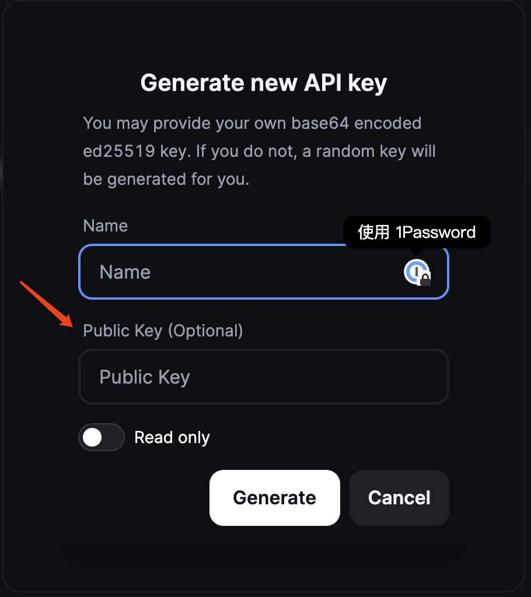
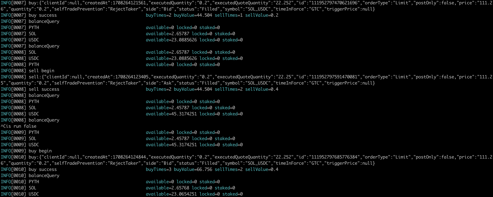

# opensource
- twitter:https://twitter.com/theq_ok
- 宁愿不打也不能喂狗 


## usage

```
git clone https://github.com/tofuhua/opensource

go mod download
```

## backpack 刷单

复制一份 backpack.yaml.example 命令为 backpack.yaml


第一次运行生成 key 和 secret

```
go run cmd/backpack/main.go -c ./etc

INFO[0000] 配置成功 请将 api.key 添加到网站                         
api.key="ozwGa2KbfOR2szR7ubtJLltOIdJkp/LaV/aZDayHLno=" 
api.secret="oFw/y69cF1xyzeGF53uC1GJGFfVOza1OFvyelEEB6h+jPAZrYpt85HazNHu5u0kuW04h0mSn8tpX9pkNrIcueg=="
```




配置交易对

```
api:
    account: main
    key: 第一步生成的
    secret: 第一步生成的
exchange:
    amount: 0.2 // 每次买多少
    buy_symbol: USDC
    sell_symbol: SOL
    symbol: SOL_USDC

```

大功告成

运行
```
go run cmd/backpack/main.go -c ./etc
```

喝杯咖啡 等刷单





```
ctrl + c 退出刷单
```